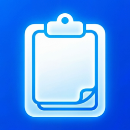

<h1 align="center">Your clipboard, with a memory.</h1>

Find the text, images, and files you copied. Get back to doing.

<strong>Free · Open source · No account · macOS 14+</strong>

**Installer status:** Apple signing is pending. The releases page currently offers source code, not a ready-to-install Mac download.

### Copy. Find. Reuse.

1. Open Clippy. The welcome screen takes a moment and is optional.
2. Copy anything. Press **⌘⇧V** to search your history.
3. Choose an item and paste. Enable optional Accessibility for automatic paste.

History stays on your Mac. Updated Clippy and Coworker builds automatically combine it, without an account. The Coworker dictation banner is optional and dismissible.

**Optional AI:** Off by default. AI features use online services; voice needs your own Gemini key. [Privacy details](PRIVACY.md).

[Build it yourself](DEVELOPMENT.md) · [Report an issue](https://github.com/mmkontis/clippy-macos/issues) · [MIT license](LICENSE)
