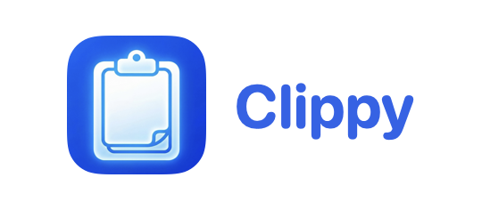
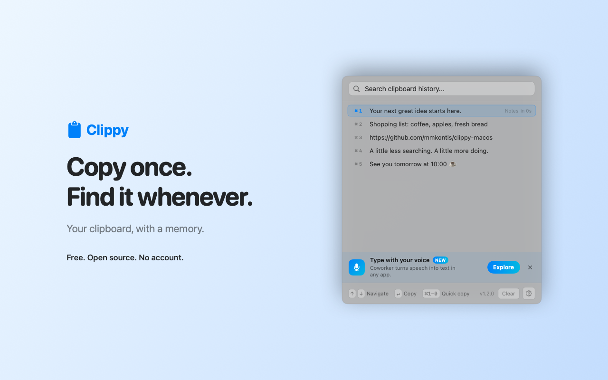
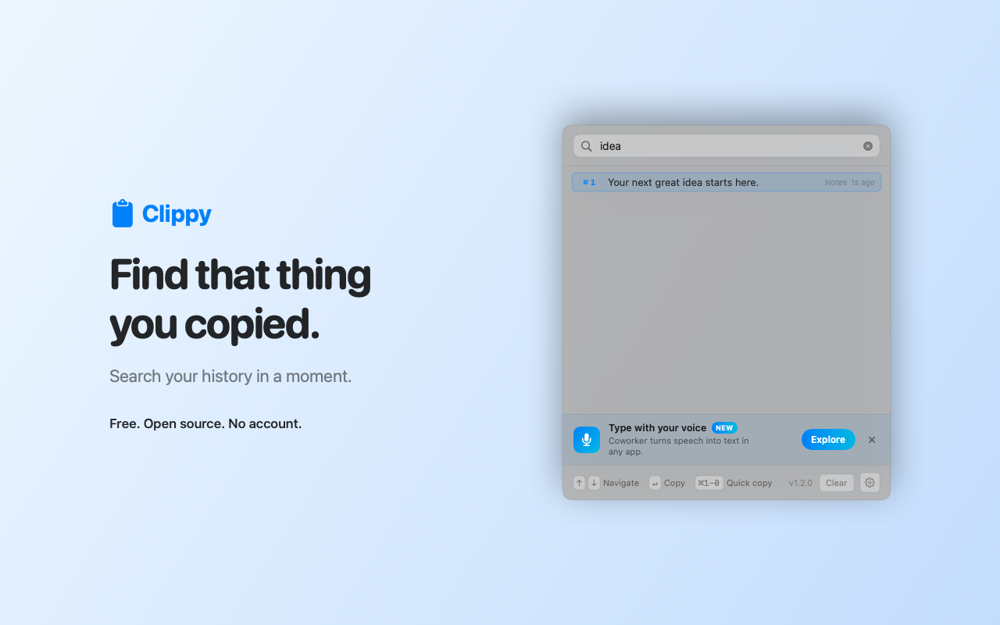
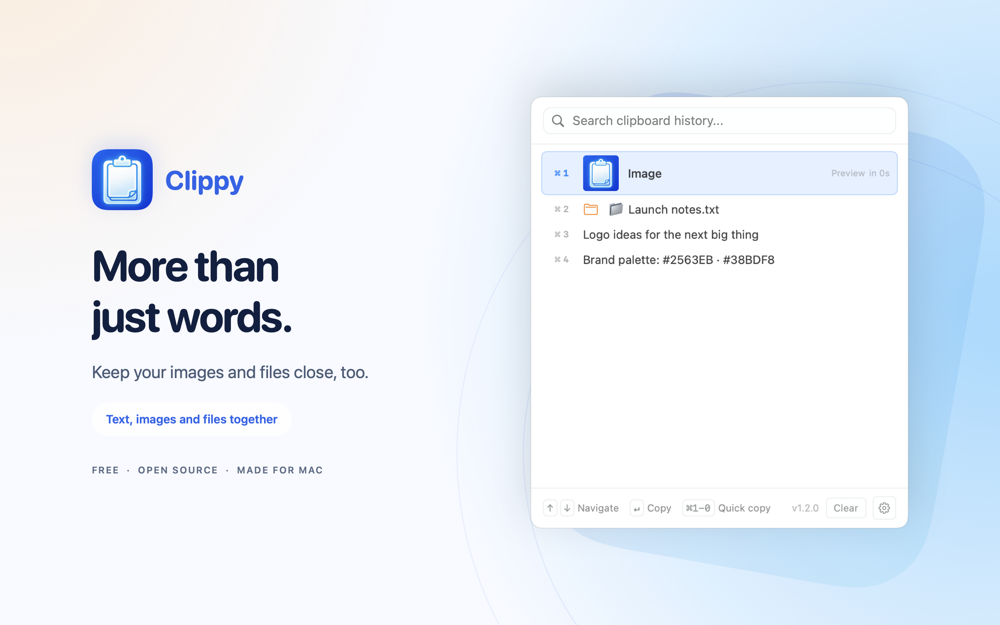
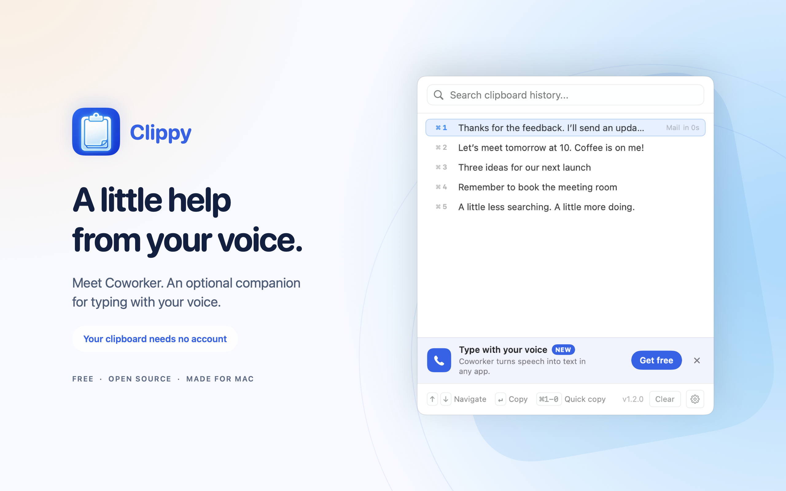
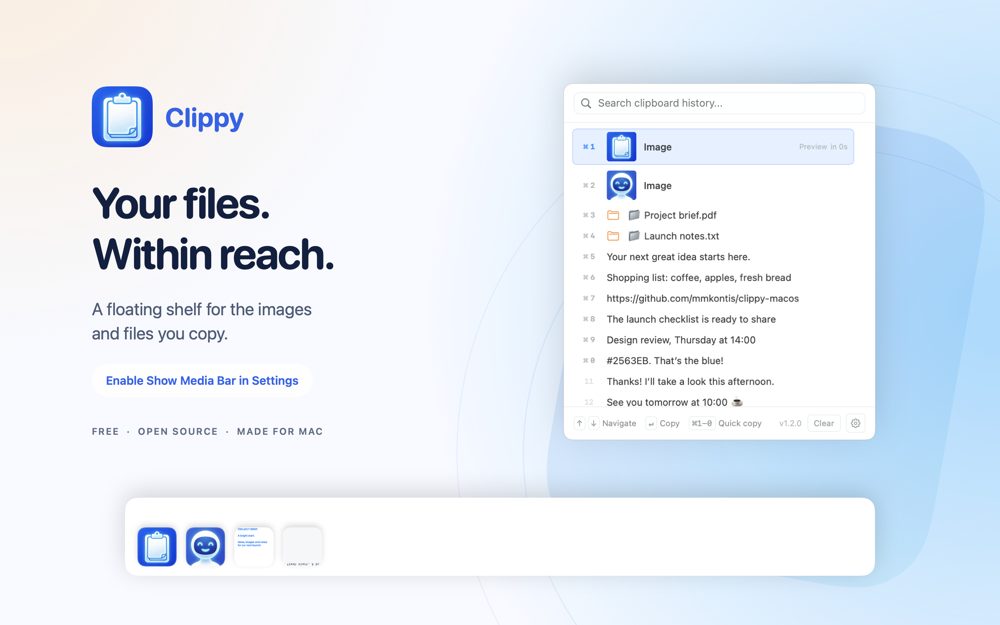

<h1 align="center">Your clipboard, with a memory.</h1>

Find the text, images, and files you copied. Get back to doing.

<strong>Free · Open source · No account · macOS 14+</strong>

**Install:** Download the ZIP, unzip it, and drag **Clippy.app** into **Applications**. Apple signed and notarized. Works on Apple Silicon and Intel.

  
  
  

### Copy. Find. Reuse.

1. Open Clippy. The welcome screen takes a moment and is optional.
2. Copy anything. Press **⌘⇧V** to search your history.
3. Choose an item and paste. Enable optional Accessibility for automatic paste.

History stays on your Mac. Updated Clippy and Coworker builds automatically combine it, without an account. The Coworker dictation banner is optional and dismissible.

**Optional AI:** Off by default. AI features use online services; voice needs your own Gemini key. [Privacy details](PRIVACY.md).

[Build it yourself](DEVELOPMENT.md) · [Report an issue](https://github.com/mmkontis/clippy-macos/issues) · [MIT license](LICENSE)
